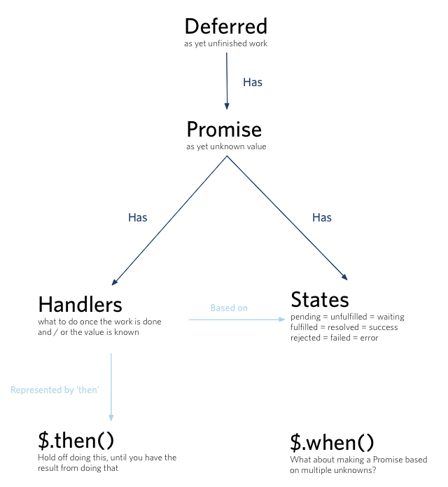

Deferred和Promise的关系

简单来说，Deferred和Promise具有如下的关系。
* Deferred 拥有 Promise
* Deferred 具备对 Promise的状态进行操作的特权方法

我想各位看到此图应该就很容易理解了，Deferred和Promise并不是处于竞争的关系，而是Deferred内涵了Promise。+

* a promise represents a value that is not yet known
* a deferred represents work that is not yet finished

* Promise代表了一个对象，这个对象的状态现在还不确定，但是未来一个时间点它的状态要么变为正常值（FulFilled），要么变为异常值（Rejected）；

* 而Deferred对象表示了一个处理还没有结束的这种事实，在它的处理结束的时候，可以通过Promise来取得处理结果。